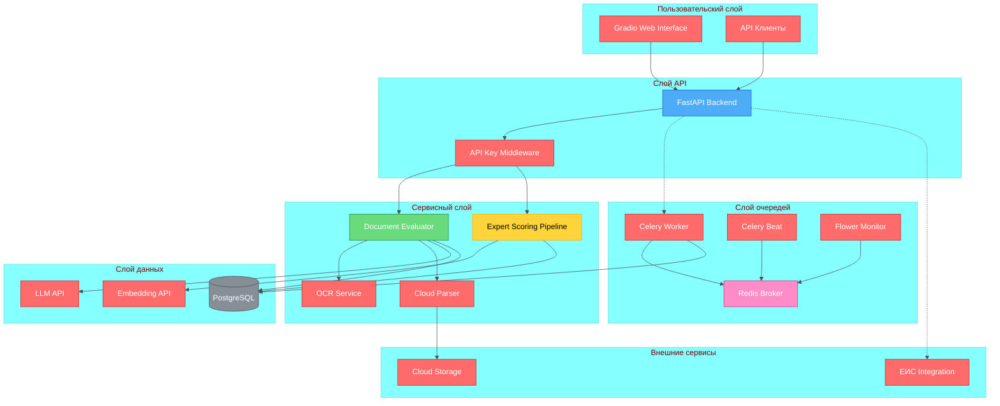
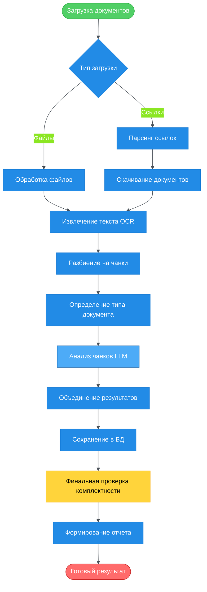

- ├── src/                       # Основная логика
- │   ├── evaluator.py          # Анализ документов
- │   ├── scoring.py            # Подбор экспертов
- │   ├── ocr.py                # OCR обработка
- │   └── prompts.py            # Промпты для LLM
+ ├── conclusion/                # Формирование заключений РАО
+ ├── evaluate_documents/        # Оценка документов
+ ├── search_experts/           # Поиск и скоринг экспертов
+ ├── configs/                  # Конфигурация
+ ├── src/                      # Основные сервисы
+ ├── schemas/                  # JSON схемы для LLM
+ ├── prompts/                  # Промпты
+ └── xml/                      # XML шаблоны# AI Assistant RAO

AI-ассистент для комплексного анализа документов закупок и подбора экспертов.

## Описание проекта

**AI Assistant RAO** - это интеллектуальная система для автоматизации экспертизы закупочных документов, построенная на базе современных технологий машинного обучения и обработки естественного языка. Система обеспечивает полный цикл анализа документации: от определения типов документов до проверки комплектности, согласованности данных и подбора релевантных экспертов.

### Ключевые возможности

- 🤖 **Автоматическое определение типов документов** с использованием языковых моделей
- 📊 **Комплексная проверка комплектности** документов согласно требованиям законодательства
- 🔍 **Анализ согласованности данных** между различными документами закупки
- 📝 **Формирование структурированных заключений** по каждому документу
- 👥 **ML-подбор экспертов** на основе релевантности и отсутствия конфликтов интересов
- 🌐 **Web-интерфейс** для удобной работы с документами
- ⚡ **Асинхронная обработка** больших объемов данных

## Архитектура системы

### Компоненты системы



### Поток обработки документов



## Технологический стек

### Backend
- **FastAPI** - высокопроизводительный веб-фреймворк
- **Python 3.11** - основной язык разработки
- **PostgreSQL** - основная база данных
- **Celery** - асинхронная обработка задач
- **Redis** - брокер сообщений и кэширование

### AI/ML компоненты
- **OpenAI API** - языковая модель для анализа документов
- **Qwen/Qwen2.5-14B-Instruct** - основная LLM
- **Scikit-learn** - ML алгоритмы для подбора экспертов
- **Embedding API** - векторизация текстов

### Обработка документов
- **Tesseract** - OCR для распознавания текста
- **python-docx** - работа с Word документами
- **PyPDF2** - работа с PDF
- **OpenCV** - обработка изображений
- **Playwright** - веб-скрапинг

### Frontend
- **Gradio** - веб-интерфейс для взаимодействия с системой
- **Flower** - мониторинг Celery задач

## Структура проекта

```
assistant-rao/
├── main.py                    # Основное FastAPI приложение
├── tasks.py                   # Celery-задача по оценке документов
├── celery_app.py              # Конфигурация Celery
├── docker-compose.yml         # Docker композиция
├── Dockerfile                 # Docker образ приложения
├── init.sql                   # Инициализация БД
├── requirements.txt           # Python зависимости
├── configs/                   # Конфигурационные модули
│   ├── config.py              # Основная конфигурация
│   ├── working_with_db.py     # Работа с БД
│   ├── parsing.py             # Парсинг документов
│   ├── retry_utils.py         # Механизмы повторных попыток
│   └── ...
├── src/                       # Основная логика
│   ├── evaluator.py           # Анализ документов
│   ├── scoring.py             # Подбор экспертов
│   ├── ocr.py                 # OCR обработка
│   └── prompts.py             # Промпты для LLM
├── conclusion/                # Формирование заключений РАО
├── evaluate_documents/        # Оценка документов
├── search_experts/            # Подбор и скоринг экспертов
│   ├── pipeline.py            # Основной пайплайн
│   ├── data_fetcher.py        # Загрузка данных
│   ├── embedding_client.py    # Клиент эмбеддингов
│   ├── text_processor.py      # Обработка текстов
│   └── conflict_detector.py   # Детектор конфликтов
├── schemas/                   # JSON схемы для LLM
├── prompts/                   # Промпты
└── xml/                       # XML шаблоны
└── test/                      # Тесты
    └── load_test.py           # Нагрузочные тесты
```

## API Эндпоинты

### Основные эндпоинты

#### `POST /evaluate-documents`
Комплексный анализ документов закупки

**Параметры:**
- `procurement_id` (str): ID закупки
- `files` (List[File]): Файлы документов
- `links` (List[str]): Ссылки на документы
- `legislation` (str): Тип законодательства (44-ФЗ, 223-ФЗ)
- `procurement_method` (str): Способ закупки
- `expertise_details` (str): Тип экспертизы

**Ответ:** JSON с результатами анализа

#### `POST /get-contract-info`
Получение реквизитов контракта

**Параметры:**
- `procurement_id` (str): ID закупки

**Ответ:** JSON с номером, суммой и датой контракта

#### `POST /get-experts-for-expertise`
Подбор экспертов для экспертизы

**Параметры:**
- `expertise_id` (int): ID экспертизы

**Ответ:** Список ID подходящих экспертов

#### `GET /health`
Проверка работоспособности сервиса

**Ответ:** JSON со статусом сервиса

## Развертывание

### Требования
- Docker и Docker Compose
- Python 3.11+
- PostgreSQL 15+
- Redis 7+

### Запуск через Docker Compose

1. **Клонирование репозитория:**
```bash
git clone <repository-url>
cd assistant-rao
```

2. **Настройка переменных окружения:**
```bash
cp .env.example .env
# Отредактировать .env с необходимыми параметрами
```

3. **Запуск системы:**
```bash
docker-compose up -d
```

4. **Проверка работоспособности:**
```bash
curl http://localhost:2300/health
```

### Порты сервисов
- **FastAPI API**: `2300:20142`
- **Gradio Interface**: `2301:20141`
- **PostgreSQL**: `2302:5432`
- **Redis**: `6379:6379`
- **Flower**: `5555:5555`

## Конфигурация

### Переменные окружения

#### База данных
- `DB_HOST`: хост PostgreSQL
- `DB_PORT`: порт PostgreSQL
- `DB_NAME`: имя базы данных
- `DB_USER`: пользователь БД
- `DB_PASSWORD`: пароль БД

#### AI модели
- `MODEL_API_URL`: URL API языковой модели
- `MODEL_NAME`: название модели
- `MODEL_API_KEY`: ключ доступа к API
- `EMBEDDING_URL`: URL сервиса эмбеддингов
- `EMBEDDING_MODEL`: модель эмбеддингов

#### Безопасность
- `API_KEY`: ключ для доступа к API
- `API_KEY_HASH`: хеш ключа

#### Приложение
- `APP_ENV`: окружение (development/production)
- `LOG_LEVEL`: уровень логирования
- `MODEL_TEMPERATURE`: температура модели
- `MODEL_MAX_TOKENS`: максимальное количество токенов

## Особенности архитектуры

### 1. Модульная структура
Система построена по миксервисной архитектуре с четким разделением ответственности между компонентами.

### 2. Асинхронная обработка
Использование Celery позволяет обрабатывать большие объемы документов без блокировки основного API.

### 3. Отказоустойчивость
Внедрены механизмы повторных попыток для всех внешних вызовов и операций с БД.

### 4. Масштабируемость
Горизонтальное масштабирование воркеров Celery для обработки пиковых нагрузок.

### 5. Безопасность
Многоуровневая аутентификация и валидация входных данных.

## Мониторинг

### Flower
Веб-интерфейс для мониторинга Celery задач доступен по адресу:
```
http://localhost:5555
```

### Логирование
Система использует структурированное логирование с различными уровнями детализации.

## Тестирование

### Запуск нагрузочных тестов
```bash
python test/load_test.py
```

### Покрытие тестами
- Unit тесты для основных модулей
- Интеграционные тесты API
- Нагрузочные тесты для проверки производительности

## Лицензия

[Информация о лицензии]

## Контакты

[Контактная информация]